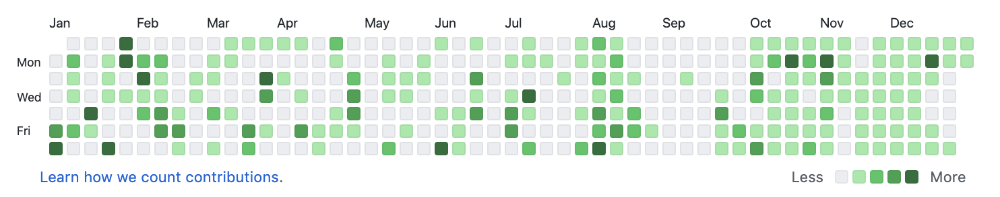

Several years ago, I lived at the Zen Center of New York City, a Zen temple focused on supporting lay practitioners (folks who practice but also have jobs, families, and so on).
Living at a Zen center is inherently intensive.
You follow the temple schedule---morning and evening meditation, work and meals together, and regular meditation retreats---as well as managing your other responsibilities.
Yet, there's an ease to practicing meditation in such a place.
You don't have to expend mental energy to get yourself to practice because everything about places like ZCNYC supports your practice.
Your schedule is clear.
Even if you sleep in (🙋), someone will come to get you to join in the meditation hall (😅).
Your life *systematically* supports your practice.

When I moved to California for my Ph.D., I had a hard time with my practice.
I didn't lack interest or motivation: I knew from direct experience that it was necessary.
But now, without the structure of the Zen center, *I* was responsible for making it happen.
After months of struggling with sitting[^1] every day, I decided enough was enough.
I made a vow: I was going to sit every day, first thing, for the rest of my life.
I didn't commit to a certain amount of hours or any other requirement.
I just focused on consistency.

[^1]: The term "sitting" is a euphemism for doing meditation.
    It's prevalent in Zen, where we practice [zazen](https://zmm.org/teachings-and-training/meditation-instructions/), a form of silent, seated meditation.
    In fact, "zazen" means "seated meditation" or "sitting Zen".

Making a vow to sit every day completely changed my experience.
Why?
The answer was clear to me almost immediately: the debate in my head was gone.
There was no more "should I sit?", no more "how long?" or "when?".
I didn't worry about it, because it was a solved problem: I sit every day, first thing---nothing to think about.
Even though spending *more* time practicing was valuable to me, I didn't focus on that.
I focused on the system that got me on the cushion.
Because my practice is important to me, spending more time doing it bloomed naturally from a consistent habit; if I just got on the cushion every day, that was enough.

I recently read [*Atomic Habits* by James Clear](https://jamesclear.com/atomic-habits), which I quite liked ([here's a summary](https://kislayverma.com/books/book-review-atomic-habits/)).
Many books on productivity amount to one or two useful blog posts wrapped in 200 pages of gimmicky marketing, but I found this book readable and practical, supported by research.
When I read the book, I realized: oh, what I did with my practice was an atomic habit.
I focused on small, consistent actions that build on their own.
I ingrained them in my life so that I did not need to think about it.
I *became* a person who gets on the cushion every day.

# Data science as an Atomic Habit

In Clear's view, the most important habits are small and consistent, whose benefits slowly build and compound over time, much like my commitment to sit every day.
Where we get tripped up is this second part, and this especially true in learning data science.
We *think* our abilities should grow linearly to our effort, but that is not so.
My experience learning R and other data science tools followed this type of non-intuitive path: I had an expectation of what my progress should be that turned out to be quite different from what actually happened.
When you're learning R or python, for instance, you may find yourself wondering why, if you're coding or studying every day, you still feel like the language doesn't *get* you.
Clear uses a diagram to show this, but since this is a data science post, we might as well draw it in R:

```{r}
library(ggplot2)
inner_thoughts <- tibble::tribble(
  ~x,  ~y,    ~label,
  0,   800,   "Cool!",
  0.9, 800,   "...?",
  1.8, 1400,  "object... of\ntype... closure?",
  3.9, 900,   "Ugghhhh",
  5.3, 1200,  "Ugghhhhhh",
  6.7, 2500,  "Oh wait",
  7.7, 4000,  "...!!",
  8.5, 8000,  "!!!!!",
  7.9, 20000, "Oh sure, it's easy"
)

ggplot() + 
  geom_function(fun = exp, size = 1.2, color = "firebrick") + 
  geom_text(data = inner_thoughts, aes(x, y, label = label), hjust = 0) +
  xlim(0, 10) + 
  ggtitle("Mastering a programming language") + 
  theme_void(24)
```

This is the stubbornly quiet path of practice: our abilities lag behind our effort.
At the "Ugghhhh" stage, our internal motivation starts to dissolve.
Sure, you can make a plot or whatever, but you're still fighting errors all day.
What do you have to show for it at this point?
Not that much more, you might feel, than when you started.
But our growth is rarely linear: often, it's explosive, at least at critical moments [^2].
We suddenly begin to make connections, which help us build other relationships, and so on.
Growth is never infinite (bad news: even if you manage to improve every day, you'll die eventually), but it's also rarely as linked to our *immediate* efforts as we expect.

[^2]: I portray it here as exponential, after Clear's diagram, but that's almost certainly not right, either.
    In my experience, it's more like a wiggly logistic curve!

# Practice and becoming are one action

With a meaningful habit---like learning data science---part of the issue is that we're focused on the results as if our (not) being a data scientist is equal to how many errors our code makes.
But that's not quite right.
If you're learning to run, for instance, you aren't becoming a person who runs for 30 minutes.
You're becoming a *runner*.
That transformation is more profound, more challenging, and more bountiful.
Running 30 minutes is just a useful strategy to engage with that transformation.
When you're sitting down with code and data, you're not becoming a person who types R code without errors[^3].
[You're *becoming* a data scientist](https://jamesclear.com/identity-based-habits).
Becoming---birth---is a slow, sometimes painful, but ultimately astounding process.
In Zen, we say, "don't put a head on top of your own." Don't confuse the results with what's really happening.

[^3]: More good news/bad news: you're never going to stop writing code with bugs.
    You might as well make friends with it now!

One of the better Hadley Wickham gifs is this one, [where he's warning R learners](http://datascience.la/hadley-wickhams-dplyr-tutorial-at-user-2014-part-1/) that, well, you're going to suck at R for a while:

```{r echo=FALSE}
blogdown::shortcode('tweet', '1022233480497954817')
```

The fuller quote is:

> Whenever you're learning a new tool, for a long time, you're going to suck... But the good news is that is typical; that's something that happens to everyone, and it's only temporary.

I've always liked this because you *should* prepare yourself for not being a master programmer for a while; it is an inherent part of the process and mostly unavoidable.
However, I also think it's good to recognize that your learning and effort are not going to waste.
*Becoming* a data scientist merely lags behind the effort we put in to *practicing* data science.
Practice and becoming are one process, one action, but we often don't see how they're connected.
What's happening underneath the surface of our effort is quiet---right until it rises with a fury.

# One foot after the other

Pick something small that you can squeeze in on your busiest of days, and know when you're going to do it.
This last part is essential: if you don't have a set period to engage with your habit, you don't know you missed it (until the end of the day when perhaps it's too late).
A useful strategy is to [stack the new habit on an existing habit](https://jamesclear.com/habit-stacking).
Do you already make a cup of coffee every morning?
Make a clear commitment attached to that habit: "I'm going to \_\_\_\_\_\_\_ every morning right after I make a cup of coffee." The habit you stack it on top of can be anything as long as it's something you do every day.

So what would an atomic habit for becoming a data scientist look like?
Here are a few ideas:

1.  Open RStudio and type "Good morning, R" into the console. That's it. Seriously.
2.  Write code for 5 minutes
3.  Use one new function. Reading the help page counts.
4.  Make a single commit on git.

Stacking these habits might look something like: "Every morning after I make coffee, I'll write code for five minutes."

These tiny habits are useful because you can always fit them in, but they work best when you have a sense of what you might do after.
When I used to run (before a hamstring injury), I followed a running schedule, but when I was having trouble getting off the couch (which was often, especially in winter), I would say to myself: "all you have to do is put on your running shoes and step out on the porch, then you can be done." Usually, that was enough for me to engage with whatever my original plan was.
It's also helpful if you're plan involves cool or urgent things to keep you motivated.
Luckily, in the world of data science, there's no shortage of either.
Focus on high-impact activity that will keep you motivated while you're not yet in the "!!!" stage.
Many data scientists will benefit most from starting with data visualization and project workflow tools, while a software engineer might benefit from starting with language fundamentals or using multiple languages together.[^4]

[^4]: Where you start in a language depends on your goals and your background.
    Many teachers of R and python begin with things like object types and control flow.
    Those are *language* fundamentals; you'll probably need to know them eventually.
    But if you're studying data science, you might be better off starting with *data science* fundamentals: reading data, visualizing data, manipulating data, and so on.
    Of course, there's not a correct order.
    Perhaps you have a computer science background, and starting with control flow sounds comforting to you!

In other words, the habit you're building is showing up.
Action drives motivation.
When you wait around for motivation to manifest action, well, you end up waiting around a lot.

# Tracking

It helps if you track your habit to make sure you *are* showing up.
One nice feature of GitHub is that it shows your commit history in a heatmap; if you commit, it's green, and if not, it's gray.
If your habit is to make a commit every day, don't leave any gray squares.

```{r, echo=FALSE}

```

GitHub's heatmap is very similar to a popular productivity technique: [The Seinfeld Chain](https://lifehacker.com/jerry-seinfelds-productivity-secret-281626).
Jerry Seinfeld committed to writing a joke every day.
He had a big, daily calendar, and he crossed off a day in red marker every time he wrote.
You build up a chain of red Xs.
Quoth Jerry: "Don't break the chain."

Several apps are good for this.
I use [HabitHub](https://www.thehabithub.com/).
I used to draw out 365 squares in my gridded Moleskine notebook and cross them off manually.

Right now, I track five habits on HabitHub.
I slowly added them, focusing on one at a time, until they felt secure, then I add another.
I also made modifications to them over time as my needs for this support changed.
Some habits became so automatic that I didn't need to track them anymore, while others benefited from creating a new, closely-related habit to stack on the one that had become stable.

# Trust yourself

Ultimately, what you're cultivating here is consistency and patience with the process.
We often conflate patience with grit.
Patience, however, is not endurance; patience is trust.
It is, in particular, trust in yourself.
That's good news because, while keeping your nose to the grindstone is useful, it's not sustainable.
Eventually, you run out of nose.
Instead, apply your grit to where it's most beneficial: consistency and trust.
Get to the keyboard every day; make that commit every day; show up.
While you're doing that, choose to see your victories.
Cultivate trust in yourself by witnessing yourself *for who you are*: someone who is capable of what you've set out to do.
Witness the evidence of your abilities---perhaps small and simple at first.
Then witness them bloom.
